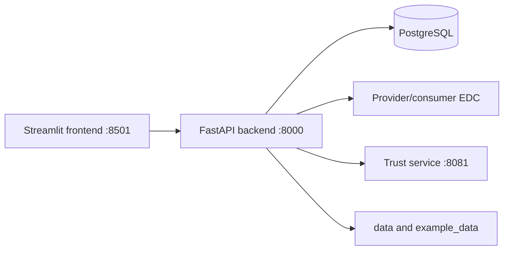

# Architecture

```mermaid
flowchart LR
  UI[Streamlit frontend :8501] --> API[FastAPI backend :8000]
  API --> DB[(PostgreSQL)]
  API --> EDC[Provider/consumer EDC]
  API --> Trust[Trust service :8081]
  API --> Files[data and example_data]
```

The repository contains all application source and deployment definitions required by the local compose topology.
