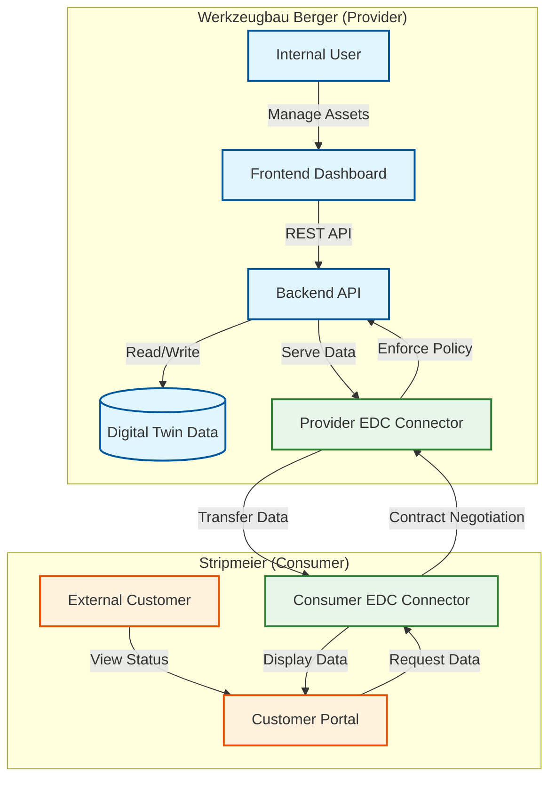

# System Architecture

This document describes the architecture of the BergerConnect X Sovereign Data Exchange platform.

## High-Level Architecture

The high-level architecture illustrates the interaction between the primary actors (Provider and Consumer) and the core system components. It highlights the role of the IDS Connectors (EDC) in mediating data access.



## Detailed System Architecture

The detailed architecture breaks down the internal components of the Backend and Frontend services, including specific API endpoints, data processing modules (PDF Parsing), and the data storage structure.

```mermaid
graph TB
    subgraph "Frontend Container (Streamlit)"
        direction TB
        AppPy[app.py]
        
        subgraph "Views"
            ProviderView[Provider Dashboard]
            ConsumerView[Customer Portal]
        end
        
        subgraph "Logic"
            AuthLogic[Role Switcher]
            APICalls[API Client Wrapper]
        end

        AppPy --> AuthLogic
        AuthLogic -->|Internal| ProviderView
        AuthLogic -->|External| ConsumerView
        ProviderView --> APICalls
        ConsumerView --> APICalls
    end

    subgraph "Backend Container (FastAPI)"
        direction TB
        MainPy[main.py]
        
        subgraph "API Routers"
            ToolRouter["/api/tool endpoints"]
            FileRouter["/api/files endpoints"]
            RepoRouter["/api/repository endpoints"]
        end

        subgraph "Core Logic"
            PolicyEngine[Policy Enforcement]
            PDFParser[PDF Timeline Extractor]
            MockEDC[Mock EDC Logic]
        end

        subgraph "Data Layer (In-Memory + Files)"
            MockDB[(digital_twin_db Dict)]
            DataDir[./data/]
            ExampleData[./example_data/]
        end

        MainPy --> ToolRouter
        MainPy --> FileRouter
        MainPy --> RepoRouter

        ToolRouter --> MockDB
        ToolRouter --> PolicyEngine
        
        %% PDF Parsing Flow
        ToolRouter -->|Attach File| PDFParser
        PDFParser -->|Read| ExampleData
        PDFParser -->|Extract Gantt| MockDB
        
        %% File Serving
        FileRouter -->|Serve| DataDir
        RepoRouter -->|List| ExampleData
    end

    %% Interactions
    APICalls -->|HTTP Requests| MainPy

    %% Specific Data Flows
    ProviderView -->|Create/Update Tool| ToolRouter
    ProviderView -->|Attach PDF| ToolRouter
    ConsumerView -->|Request Status| ToolRouter
    ConsumerView -->|Download File| FileRouter

    %% Policy Check
    ToolRouter -->|Check Access| PolicyEngine
    PolicyEngine -->|Log Access| MockDB

    %% Styling
    classDef container fill:#f5f5f5,stroke:#333,stroke-width:2px;
    classDef component fill:#ffffff,stroke:#666,stroke-width:1px;
    classDef db fill:#e1f5fe,stroke:#0277bd,stroke-width:2px;

    class Frontend Container,Backend Container container;
    class AppPy,MainPy,ProviderView,ConsumerView,AuthLogic,APICalls,ToolRouter,FileRouter,RepoRouter,PolicyEngine,PDFParser,MockEDC component;
    class MockDB,DataDir,ExampleData db;
```

## Generative AI Architecture Prompts

Use the following descriptions as prompts for generative AI models (like Midjourney, DALL-E 3, or Gemini) to create visualizations of the system architecture.

### High-Level Architecture Prompt

> Create a simplified, high-level conceptual diagram for a Sovereign Data Exchange platform named "BergerConnect X".
>
> **Visual Composition:**
> *   **Left Zone (Provider):** A stylized factory building icon labeled "Werkzeugbau Berger". Connected to it is a shield-guarded server labeled "Provider Connector".
> *   **Right Zone (Consumer):** A modern office building icon labeled "Customer Stripmeier". Connected to it is a matching server labeled "Consumer Connector".
> *   **Center Connection:** A glowing, secure digital bridge connecting the two Connectors. Label this bridge "IDS Data Space".
> *   **Data Flow:** Show a document file with a "Contract" seal moving securely across the bridge from the Factory to the Office.
>
> **Style:** Minimalist flat vector art. Corporate color scheme: Blue for the Provider, Orange for the Consumer, Green for the secure connection. Clean white background.

### Detailed Architecture Prompt

> Create a high-fidelity technical system architecture diagram for a Sovereign Data Exchange Platform called "BergerConnect X". The diagram should be split into two distinct security zones: a "Provider Domain" on the left and a "Consumer Domain" on the right, connected by a central "IDS Data Space".
>
> **1. Left Side: Provider Domain (Werkzeugbau Berger)**
> *   **Top Layer (Frontend):** Show a computer screen displaying a "Streamlit Dashboard". Label it "Provider UI". It shows controls for "Asset Management" and "Policy Definition".
> *   **Middle Layer (Backend):** A central server block labeled "FastAPI Backend". Inside this server, visualize three key internal components:
>     *   *PDF Parser Engine:* Depict a document icon entering a gear system and turning into a structured timeline bar chart.
>     *   *Policy Enforcer:* A shield icon representing security rules (e.g., "Time-Restricted Access").
>     *   *Mock EDC Logic:* A module handling the handshake with the outside world.
> *   **Bottom Layer (Storage):** A database cylinder labeled "Digital Twin DB" (JSON) and a file folder labeled "Local Repository" (PDFs/CAD).
> *   **Gateway:** A distinct server unit at the edge labeled "Provider EDC Connector" (Eclipse Dataspace Connector).
>
> **2. Right Side: Consumer Domain (Stripmeier)**
> *   **Gateway:** A matching server unit at the edge labeled "Consumer EDC Connector".
> *   **Top Layer (Frontend):** A computer screen displaying a "Customer Portal". It shows a "Live Gantt View" and "Secure Download" buttons.
>
> **3. Center: The IDS Data Space**
> *   Draw a secure, encrypted tunnel connecting the Provider EDC and Consumer EDC.
> *   Inside the tunnel, show a data packet traveling from left to right.
> *   Superimposed on the tunnel is a "Smart Contract" icon (scroll) representing the usage policy being negotiated.
>
> **Style:** Clean, modern isometric technical illustration. Use a professional color palette: Deep Blue for the Provider infrastructure, Warm Orange for the Consumer infrastructure, and Bright Green for the secure Data Space connections. Text should be legible and sharp.

